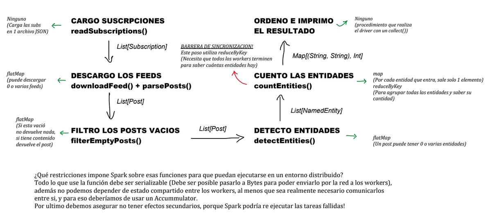

# Ejercicio 1 

## Diagrama de flujo 

    CARGA DE SUBSCRIPCIONES
    readSubscriptions()
            |
            |   List[Subscription]
            |
            V
    DESCARGA DE FEEDS 
    downloadFeed() + parsePosts()
            |
            |   List[Post]
            |
            V
    FILTRADO DE POSTS VACIOS
    filterEmptyPosts()
            |
            |   List[Post]
            |
            V        
    DETECCCION DE ENTIDADES
    detectEntities()
            |
            |   List[NamedEntity]
            |
            V
    CONTADOR DE ENTIDADES
    countEntities()
            |
            |   Map[(String, String), Int]
            |
            V 
ORDENACION E IMPRESION DEL RESULTADO

## Abstracciones en el Pipeline
(map, flatMap, reduceByKey )

Carga de subscripciones: No se puede expresar como una abstraccion.
Descarga de feeds(Puede descargar 0 o varios feeds): Se puede expresar con la abstraccion flatMap.
Filtrado de posts vacios(Si esta vacio no retorna nada, si tiene contenido retorna el post): Se puede expresar con la abstraccion
flatMap. 
Deteccion de entidades(Un post puede tener 0 o varias entidades): Se puede expresar con la abstraccion flatMap. 
Contador de entidades: Se puede expresar con 2 abstracciones, map (por cada entidad que entra, sale solo 1 elemento), y con reduceByKey (Para agrupar todas las entidades y saber la cantidad de cada una de ellas).
Ordenacion e impresion del resultado: No se puede expresar como una abstraccion.

La carga de subscrpiciones no se puede expresar como una abstraccion, porque lo que hace es cargar las subs en 1 archivo JSON.
La ordenacion e impresion del resultado no se puede expresar como una abstraccion, porque se realiza con un collect

## Barrera de sincronizacion

Todos los pasos del pipeline pueden ejecutarse de forma independiente entre workers, excepto el paso de contar entidades, pues este paso utiliza el reduceByKey, el cual necesita que todos los workers terminen para saber la cantidad de entidades que hay.

## Restricciones sobre funciones en un entrono distribuido

Todo lo que use la función debe ser serializable (Debe ser posible pasarlo a Bytes para poder enviarlo por la red a los workers),
además no podemos depender de estado compartido entre los workers, al menos que sea realmente necesario comunicarlos
entre si, y para eso deberíamos de usar un Accummulator.
Por ultimo debemos asegurar no tener efectos secundarios, porque Spark podría re ejecutar las tareas fallidas!

## Diagrama de flujo

 
Como un extra dejo el diagrama que hice antes de implementarlo aca!